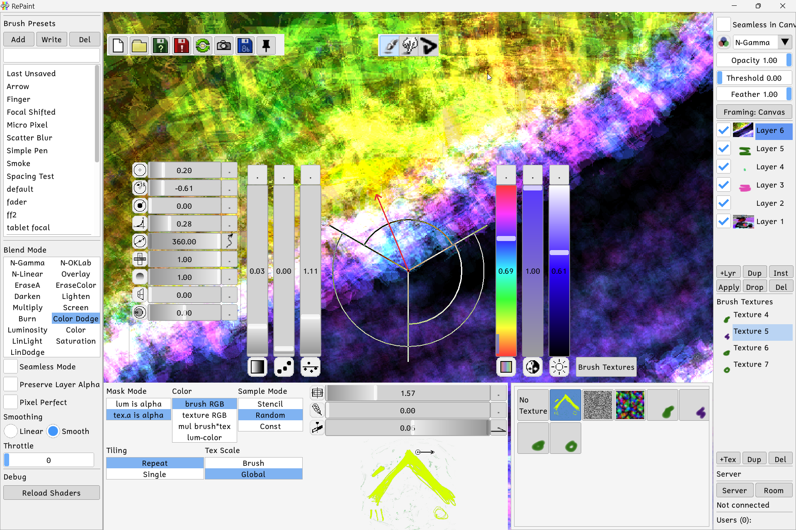

# RePaint on Raylib steroids 
Now with shaders,
AND PROPER BLENDING. Not your normal normal

Please support my neurodivergent family of 2 persons and 2 cats.
we have been on the brink of eating pigeons since 2026 started.

# Releases:
Here are most recent working releases from the main.
| Platform | Download |
|----------|----------|
| Windows-x64  | [repaint-windows.zip](https://github.com/EugeneDevastator/Repaint_raylib/releases/download/latest/repaint-windows.zip) |
| Windows-x86 (32-bit) | [repaint-windows-32.zip](https://github.com/EugeneDevastator/Repaint_raylib/releases/download/latest/repaint-windows-32.zip) |
| Linux    | [repaint-linux.zip](https://github.com/EugeneDevastator/Repaint_raylib/releases/download/latest/repaint-linux.zip) |
| Linux-i686 (32-bit) | [repaint-linux-32.zip](https://github.com/EugeneDevastator/Repaint_raylib/releases/download/latest/repaint-linux-32.zip) |
| macOS    | [repaint-mac-full.zip](https://github.com/EugeneDevastator/Repaint_raylib/releases/download/latest/repaint-mac-full.zip) |

**Source code** is licensed under AGPL v3: 

**Content creation** 

This app does not claim any rights over artwork or content you create with it.
Your work is yours — use it however you want.

# Getting started:

**'Tab'** to hide all

**'1'** to transform the layer

**'Shift'** for this qick controls

# History
Believe it or not first version of Repaint was my graduation project, and it didnt even had a name

It started as pixel based painter made with BCB6
in 2012 i ported it to QT with all the facny stuff
but qt broke tablet support and had issues with multithreading.
and now in 2026, with help of AI i ported it to raylib
painting is done with shaders, which you can edit at runtime.

# Comping up
sanity pass on whatever we have now.
Replays and network sanity pass
